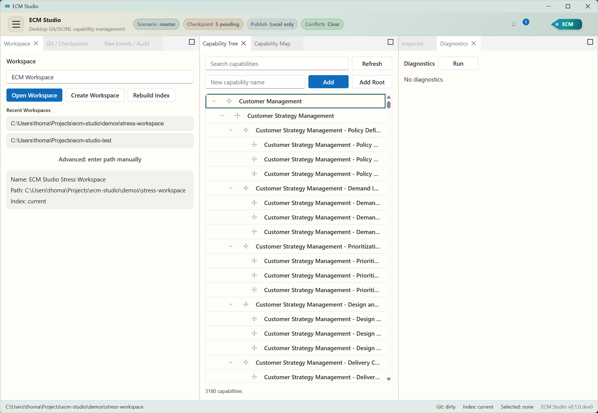

# ECM Studio

[](https://pypi.org/project/ecm-studio/)
[](https://pypi.org/project/ecm-studio/)
[](https://github.com/ThomasRohde/ecm-studio/actions/workflows/publish.yml)
[](LICENSE)

ECM Studio is a Windows-first desktop application for managing an Enterprise
Capability Model as local, Git-managed JSONL files. It gives architects and
capability owners a focused workspace for editing capability trees, reviewing
change history, publishing model snapshots, and exporting portable artifacts
without putting the authoritative model in a database.



## Highlights

- Desktop UI built with React, Dockview, Fluent UI, and pywebview.
- Durable model storage in readable JSONL files under `ecm/`.
- Git-native workflow for checkpoints, scenarios, merges, restore, pull, and push.
- SQLite projection rebuilt locally for navigation and search speed.
- Capability map view with SVG and HTML export.
- Model import/export for JSONL, CSV, and bundled JSON.
- Release workflow for tagged ECM model exports and GitHub release publication.
- Light/dark theme support with native Windows chrome integration.

## Install

ECM Studio requires Python 3.13 or newer. On Windows, install it from PyPI:

```powershell
py -m pip install ecm-studio
```

Start the desktop app:

```powershell
ecms
```

Open a workspace directly:

```powershell
ecms C:\path\to\capability-model-repo
```

Check the installed package version:

```powershell
ecms --version
```

## Workspace Model

An ECM Studio workspace is a normal Git repository. The application stores the
authoritative model in `ecm/*.jsonl` files and keeps local runtime state in
`.ecm-studio/`, which should stay ignored by Git.

The SQLite database is only a local projection. It can be rebuilt from JSONL at
any time and is not the source of truth.

## Development

Install Python and frontend dependencies:

```powershell
py -m pip install -e .[dev]
npm install --prefix ui
```

Run the Vite dev server and launch the desktop shell against it:

```powershell
npm run dev --prefix ui
py -m ecm_studio --dev-ui http://localhost:5173
```

Build the frontend assets:

```powershell
npm run build --prefix ui
```

Run checks:

```powershell
ruff check src tests scripts
pytest -q
npm test --prefix ui
npm run typecheck --prefix ui
```

## Packaging And Releases

The Python package uses Hatchling and reads its version from
`src/ecm_studio/__init__.py`.

Cut a release from a clean working tree:

```powershell
python scripts/release.py 0.1.1
git push origin master v0.1.1
```

The `publish.yml` workflow builds the React UI, stages it into the wheel, checks
the distribution with Twine, verifies packaged UI assets, and publishes tagged
`v*` releases to PyPI through trusted publishing.

Open the next development cycle after a release:

```powershell
python scripts/release.py --post-release 0.1.2.dev0
```

## License

ECM Studio is released under the [MIT License](LICENSE).
